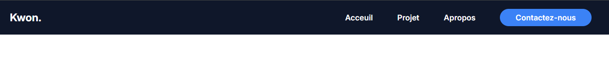
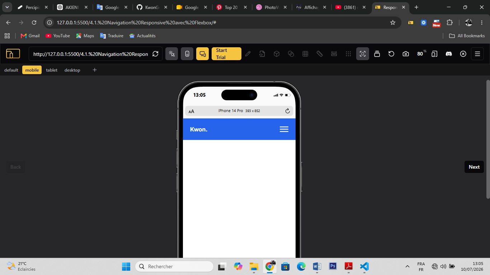
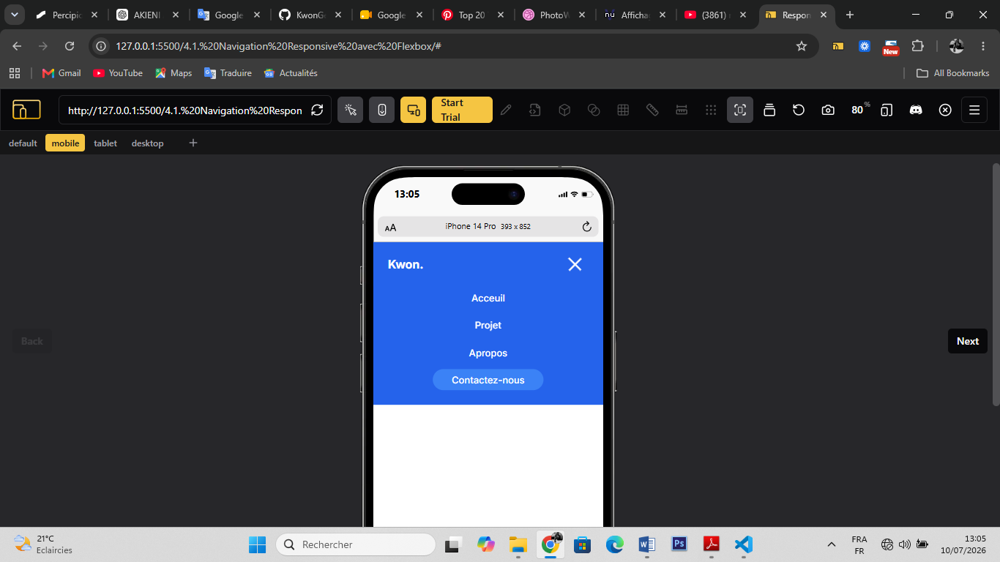
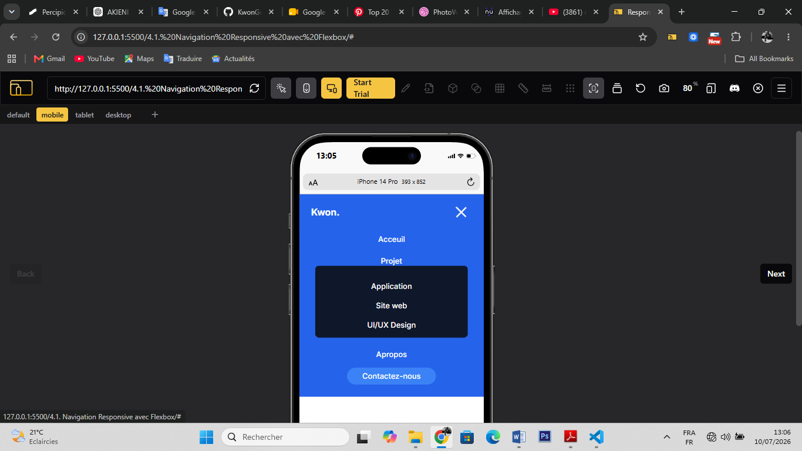

# Responsive Navbar with Flexbox

Une barre de navigation moderne et responsive développée en **HTML5** et **CSS3** dans le cadre de la formation chez **Akieni Academy**.

Ce projet met en pratique la création d'un composant de navigation réutilisable, conçu exclusivement avec **Flexbox** et un **menu burger fonctionnel en CSS** (sans JavaScript).

---

# Aperçu

## Version Desktop



---

## Version Mobile





---

# Présentation

La navigation est l'un des composants les plus importants d'un site web. Elle permet aux utilisateurs d'accéder rapidement aux différentes sections tout en offrant une expérience fluide sur ordinateur, tablette et mobile.

Dans ce projet, j'ai conçu une **barre de navigation responsive** destinée à un site web Portolio.
L'objectif était de créer une interface moderne, accessible et facilement réutilisable dans de futurs projets.

---

# Objectifs pédagogiques

Ce projet m'a permis de mettre en pratique :

- Flexbox
- Responsive Design
- Media Queries
- CSS Only Toggle
- Variables CSS
- Architecture CSS
- Hiérarchie visuelle
- Accessibilité
- Navigation responsive

---

# Fonctionnalités

- Navigation optimisée pour ordinateur
- Version responsive pour tablette et mobile
- Menu burger réalisé uniquement avec HTML et CSS
- Bouton d'appel à l'action
- Espacement cohérent avec Flexbox
- Animations et transitions CSS
- Structure HTML5 sémantique
- Composant réutilisable

---

# Technologies utilisées

- HTML5
- CSS3
- Flexbox
- Media Queries
- Google Fonts
- Remix Icon
- Git
- GitHub
- Visual Studio Code

---

# Structure du projet

```text
responsive-navbar/
│
├── index.html
├── README.md
├── style.css
```

---

# Design System

## Palette de couleurs

| Usage      | Couleur |
| ---------- | ------- |
| Primary    | #2563EB |
| Secondary  | #3B82F6 |
| Accent     | #14B8A6 |
| Background | #F8FAFC |
| Surface    | #FFFFFF |
| Text       | #1E293B |
| Border     | #E2E8F0 |

---

## Typographie

Le projet utilise :

- **Inter** → Texte courant

---

# Compétences mises en pratique

- Flexbox
- `justify-content`
- `align-items`
- `gap`
- `flex-wrap`
- Media Queries
- CSS Variables
- Positionnement
- Box Model
- Transitions
- Transform
- Responsive Design
- CSS Only Toggle (`:checked`)
- Combinateurs CSS (`+`, `~`)

---

# Accessibilité

Le projet applique plusieurs bonnes pratiques d'accessibilité :

- Structure HTML5 sémantique (`header`, `nav`)
- Liens descriptifs
- Navigation clavier
- Menu burger associé à un `<label>`
- Contraste de couleurs adapté
- États de focus visibles

---

# Compétences développées

Grâce à ce projet, j'ai renforcé mes compétences en :

- Développement Front-End
- Conception d'interfaces responsive
- Architecture CSS
- Flexbox
- Accessibilité Web
- Création de composants réutilisables

---

# Auteur

**Prosper Kwon Gee**

Étudiant en Conception des Systèmes d'Information  
Développeur Fullstack en formation chez **Akieni Academy**

- GitHub : https://github.com/KwonGee-Lukelo
- LinkedIn : https://www.linkedin.com/in/prosper-kwon-gee-59932b29a

---

# Licence

Projet réalisé à des fins pédagogiques dans le cadre de la formation chez **Akieni Academy**.
